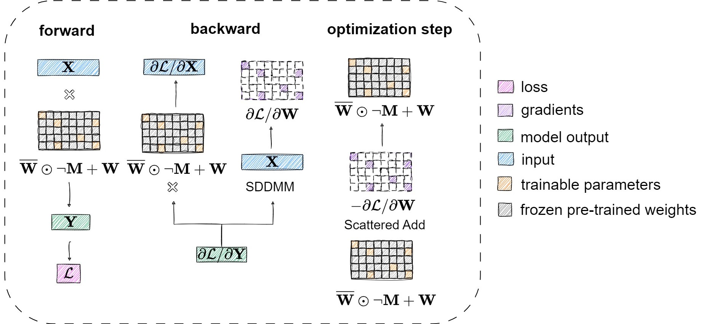

# Sylva
## Introduction
Sylva is a library that accelerates fine-tuning via hierarchical approximate second-order information and sparse embedded adapters. Sylva leverages second-order information to identify the importance of parameters in the pre-trained LLM with a pre-processing step. During fine-tuning, Sylva trains only a small number of important parameters and freezes the pre-trained weights. Furthermore, Sylva embeds the sparse trainable parameters into the frozen pre-trained weights with a block sparse pattern. Overall, Sylva obtains both high fine-tuning performance and high model quality.

<p align="center">
    
</p>

## Getting Started
**Environment**:
```
conda create -n sylva python
conda activate sylva
pip install -r requirements.txt
pip install -e .
```
**Example Usage**:
* Fine-tuning [LLaMA-7B](https://huggingface.co/huggyllama/llama-7b) with Sylva (98.4% sparsity) on the ~9k sample [OASST1 dataset](https://huggingface.co/datasets/timdettmers/openassistant-guanaco) improves 5-shot [MMLU](https://openreview.net/pdf?id=d7KBjmI3GmQ) evaluation accuracy from 32.98 to 38.13 in ~14k steps (~865 steps with 16 gradient accumulation steps).

Running
```
bash scripts/run-llama-oasst-mmlu.sh
```
will pick up the pre-computed masks (under .cache) for the sparse embedded adapters in Sylva and start fine-tuning the model.

On Google Cloud G2 machines with NVIDIA L4 GPUs, Sylva is, on average, 1.3x faster than LoRA if fine-tuning only the attention modules of LLaMA-7B, ~1.4x faster than LoRA, and ~6.4x faster than ZeRO full fine-tuning if fine-tuning all linear modules of LLaMA-7B.

## Configurations
* `scope`: The scope of modules to be fine-tuned. For example, to fine-tune all linear modules in LLaMA-7B, set the scope to `model.layers`. To fine-tune only the attention modules, set the scope to `self_attn`.
* `sparsity`: The percentage of trainable parameters for modules *under the specified scope*. The overall sparsity (i.e. the percentage of trainable parameters in the entire model) is typically higher.
* `preprocess_num_samples`: The number of samples used in the pre-processing step.
* `num_partition`: The number of partitions in the hierarchical approximation of second-order information.
* `block_size`: The size of the non-zero blocks in Sylva's sparse embedded adapters.

## Credits
We use some of the code in the [LoRA](https://github.com/microsoft/LoRA) and [qlora](https://github.com/artidoro/qlora) libraries, see [NOTICE](https://github.com/CentML/Sylva/blob/main/NOTICE) for details.

## License
This project is licensed under the [Apache 2.0 license](https://github.com/CentML/Sylva/blob/main/LICENSE).

## Publication
[Paper](https://dl.acm.org/doi/10.1145/3650200.3656619) | [The 38th ACM International Conference on Supercomputing (ICS'24)](https://ics2024.github.io/)

> **Sylva: Sparse Embedded Adapters via Hierarchical Approximate Second-Order Information**

## Citation
```bibtex
@inproceedings{sylva-ics-24,
author = {Mu, Baorun and Giannoula, Christina and Wang, Shang and Pekhimenko, Gennady},
title = {Sylva: Sparse Embedded Adapters via Hierarchical Approximate Second-Order Information},
year = {2024},
isbn = {9798400706103},
publisher = {Association for Computing Machinery},
address = {New York, NY, USA},
url = {https://doi.org/10.1145/3650200.3656619},
doi = {10.1145/3650200.3656619},
booktitle = {Proceedings of the 38th ACM International Conference on Supercomputing},
pages = {485–497},
numpages = {13},
keywords = {GPUs, fine-tuning, large language models},
location = {<conf-loc>, <city>Kyoto</city>, <country>Japan</country>, </conf-loc>},
series = {ICS '24}
}
```
